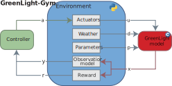

# GreenLight-Gym 2.0

## Reinforcement learning benchmark environment for control of greenhouse production systems 

<p align="center">
  
</p>

## Table of contents

- [Summary](#summary)
- [Installation](#installation)
- [Repository Structure](#repository-structure)
- [Usage](#usage)
- [Future road map](#future-road-map)
- [Citation](#citation)

## Summary

GreenLight-Gym is a benchmark simulation environment for **training and evaluating reinforcement learning (RL) controllers** in high-tech greenhouse crop production systems.

It is based on the validated high-tech greenhouse model [GreenLight](https://github.com/davkat1/GreenLight), and provides:

- Realistic greenhouse climate and crop dynamics for RL research on greenhouse production control.
- Implementation in the automatic differentiation tool CasADi for increased simulation speeds.
- Baseline rule-based controllers for benchmarking.
- Modular and flexible:
  1. Create custom environments (child of `GreenLightEnv`)
  2. Plug in your own Reward functions
  3. Observation modules
- Interchangeable weather data: train/evaluate on your own location/year weather CSVs with simple folder conventions.
- Configuration files to further customize environments: YAML configs for agents, environments, and W&B sweeps; easy hyperparameter tuning.
- Visualization tools for analysis.

This repository was used in the following accepted conference paper:

📄 [Preprint](https://arxiv.org/abs/2410.05336): [The 8th IFAC Conference on Sensing, Control and Automation Technologies for Agriculture](https://agricontrol25.sf.ucdavis.edu/)

✏ Author: Bart van Laatum

📧 E-mail: bart.vanlaatum@wur.nl

### 📣 What’s New in v0.2

v0.2 marks a shift from the v0.1 C++ build to a pure Python-native model:

> - [x] No C++ build that only works for Ubuntu.
> - [x] Easy installation for operating systems Windows, Linux, and maxOS via `pip install -e .`
>
> 🔗 For the C++ version of the GreenLight models, use **v0.1** release tag and its README.


## Installation

### Requirements
- Python >= 3.10 (tested on 3.11).
- Recommended: `conda` or `venv` for environment management.

1. **Clone the repository**
    ```shell
    git clone https://github.com/BartvLaatum/GreenLight-Gym2.git
    cd GreenLight-Gym2
    ```

2. **Setup a Python virtual environment**

    For instance, using anaconda (or `python -m venv`)

    ```shell
    conda create -n greenlight_gym python==3.11
    conda activate greenlight_gym
    ```

3. **Install the repository in Editable Mode**

   This repository is set up for an editable install using pip. From the root directory run:

   ```shell
   pip install -e .
   ```

## Repository Structure

| Folder                 | Description                                                      |
| ---------------------- | ---------------------------------------------------------------- |
| [`gl_gym/environments/`](./gl_gym/environments/) | Environment definitions: models, parameters, rewards, observations. See the detailed [environments README](./gl_gym/environments/README.md).|
| [`gl_gym/configs/`](./gl_gym/configs/)      | YAML configuration files for agents, environments, and sweeps. See the detailed [configs README](./gl_gym/configs/README.md).             |
| `gl_gym/common/`       | Shared utility functions                                         |
| `gl_gym/RL/`           | Experiment manager, training setup, W\&B integration             |
| `gl_gym/experiments/`  | Python experiment scripts (training, evaluation)                 |
| `run_scripts/`         | Bash wrappers for experiment scripts                             |
| `visualisations/`      | Plotting and analysis scripts                                    |

## Usage


### 1. **Running an RL Experiment**

To start a new reinforcement learning experiment, you can either call the Python entrypoint directly or use the bash wrapper in [`run_scripts/`](./run_scripts/). Configure the environment, algorithm, logging, and runtime behavior via the command-line flags below.

Quick start (with placeholders):

```bash
python gl_gym/RL/experiment_manager.py \
  --project PROJECT_NAME \
  --env_id ENV_ID \
  --algorithm ALGORITHM_NAME \
  --group GROUP_NAME \
  --n_eval_episodes N_EVAL_EPISODES \
  --n_evals N_EVALS \
  --env_seed ENV_SEED \
  --model_seed MODEL_SEED \
  --device DEVICE \
  --save_model \
  --save_env \
  [--stochastic] \
  [--hyperparameter_tuning]
```

Placeholders and flags:

- **PROJECT_NAME**: W&B project name used for logging and for organizing output paths (e.g., `AgriControl`).
- **ENV_ID**: Environment ID to train on (e.g., `TomatoEnv`).
- **ALGORITHM_NAME**: RL algorithm to use. Supported: `ppo`, `sac`, `recurrentppo`.
- **GROUP_NAME**: W&B group label to group runs (e.g., `ppo_det`).
- **N_EVAL_EPISODES**: Number of episodes evaluated at each evaluation step (default: `1`).
- **N_EVALS**: Number of evaluations performed across training (default: `10`).
- **ENV_SEED**: Random seed for environment dynamics (e.g., `666`).
- **MODEL_SEED**: Random seed for model initialization and training (e.g., `666`).
- **DEVICE**: Compute device (`cpu`, `cuda`, or `cuda:0`, etc.).
- **--save_model**: Passing this flag saves the trained model.
- **--save_env**: Passing this flag saves the environment normalization stats.
- **--stochastic**: Passing this optional flag saves the model and environment in a folder named `stochastic`, otherwise in `deterministic`.
- **--hyperparameter_tuning**: Optional. Run hyperparameter tuning using sweep configs in [`sweeps/`](./gl_gym/configs/sweeps/) instead of a single training run.

Example:

```bash
python gl_gym/RL/experiment_manager.py
  --project AgriControl
  --env_id TomatoEnv
  --algorithm ppo
  --group ppo_det
  --n_eval_episodes 1
  --n_evals 10
  --env_seed 666
  --model_seed 666
  --device cpu
  --save_model
  --save_env
```

Notes on I/O:

- Models are saved to: `train_data/PROJECT_NAME/ALGORITHM/[stochasticORdeterministic]/MODEL_NAME/models/best_model.zip`.
- Environments normalization statistics are saved to: `train_data/PROJECT_NAME/ALGORITHM/[stochasticORdeterministic]/MODEL_NAME/envs/best_vecnormalize.pkl`.


Bash script equivalent:

```bash
bash run_scripts/rl.sh
```

> Note: Running training will initialize a Weights & Biases session. You can log in, create an account, or proceed without logging to disable online visualizations and model logging.

### 2. **Evaluation of Trained Models**
You can evaluate trained models using `gl_gym/experiments/evaluate_rl.py`.

Quick start (with placeholders):

```bash
python gl_gym/experiments/evaluate_rl.py \
  --project PROJECT_NAME \
  --env_id ENV_ID \
  --model_name MODEL_NAME \
  --algorithm ALGORITHM \
  --mode MODE \
  --uncertainty_scale UNCERTAINTY_SCALE
```

Placeholders and flags:

- **PROJECT_NAME**: W&B project name used for organizing training outputs (e.g., `AgriControl`).
- **ENV_ID**: Environment ID used for training the model (e.g., `TomatoEnv`).
- **MODEL_NAME**: The trained model run folder name under `train_data/PROJECT/ALGORITHM/MODE/models/` (e.g., `cosmic-music-1`).
- **ALGORITHM**: Algorithm used for training. Supported for evaluation: `ppo`, `sac`.
- **MODE**: Evaluation mode; choose `deterministic` or `stochastic`. This must match the mode used during training.
- **UNCERTAINTY_SCALE**: Required numeric value controlling environment stochasticity during evaluation.
  - If `MODE=deterministic`, set `UNCERTAINTY_SCALE` to `0.0` (enforced by the script).
  - If `MODE=stochastic`, use a non-negative float (e.g., `0.1`). The script will run multiple simulations (30 by default) with randomly sampled parameters for the crop model at each time step. The simulation results are aggregated.

Notes on I/O:

- Models are loaded from: `train_data/PROJECT_NAME/ALGORITHM/MODE/models/MODEL_NAME/best_model.zip`.
- Results are saved to: `data/PROJECT_NAME/MODE/ALGORITHM/MODE/UNCERTAINTY_SCALE](if stochastic)/<MODEL_NAME+GROWTH_YEAR+START_DAY+LOCATION>.csv`.

Examples:

- Deterministic evaluation

```bash
python gl_gym/experiments/evaluate_rl.py
  --project AgriControl
  --env_id TomatoEnv
  --model_name cosmic-music-1
  --algorithm ppo
  --mode deterministic
  --uncertainty_scale 0.0
```

- Stochastic evaluation (runs 30 simulations and saves under `.../stochastic/.../<scale>/`)

```bash
python gl_gym/experiments/evaluate_rl.py
  --project AgriControl
  --env_id TomatoEnv
  --model_name cosmic-music-1
  --algorithm ppo
  --mode stochastic
  --uncertainty_scale 0.1
```

### 3. **Evaluation of Baseline Controller**
You can evaluate the rule-based baseline controller using `gl_gym/experiments/evaluate_baseline.py`.

Quick start (with placeholders):

```bash
python gl_gym/experiments/evaluate_baseline.py \
  --project PROJECT_NAME \
  --env_id ENV_ID \
  --mode MODE \
  --uncertainty_scale UNCERTAINTY_SCALE
```

Placeholders and flags:

- **PROJECT_NAME**: Project name used to organize outputs (e.g., `AgriControl`).
- **ENV_ID**: Environment ID (e.g., `TomatoEnv`).
- **MODE**: Choose `deterministic` or `stochastic`.
- **UNCERTAINTY_SCALE**: Numeric value controlling environment stochasticity during evaluation.
  - If `MODE=deterministic`, set to `0.0` for a single run.
  - If `MODE=stochastic`, use a non-negative float (e.g., `0.1`). The script runs 30 simulations with randomly sampled parameters for the crop model at each time step and aggregates results.

Notes on I/O:

- Results are saved to: `data/PROJECT_NAME/MODE/rb_baseline/UNCERTAINTY_SCALE(if stochastic)/rb_baseline-GROWTH-YEAR+START_DAY-LOCATION`.

Examples:

- Deterministic baseline evaluation

```bash
python gl_gym/experiments/evaluate_baseline.py
  --project AgriControl
  --env_id TomatoEnv
  --mode deterministic
  --uncertainty_scale 0.0
```

- Stochastic baseline evaluation (runs 30 simulations and saves under `.../stochastic/rb_baseline/<scale>/`)

```bash
python gl_gym/experiments/evaluate_baseline.py
  --project AgriControl
  --env_id TomatoEnv
  --mode stochastic
  --uncertainty_scale 0.1
```

Optional: A convenience bash script is available to sweep across multiple uncertainty scales:

```bash
bash run_scripts/eval_baseline.sh
```

> Note: On Windows, run the bash script via Git Bash.

### 4. **Visualizations**
**Plotting**: The repository includes scripts under [visualisations](./visualisations/) for plotting learning curves and cost metrics. 
Before generating any plots you must have evaluated your RL agents with `evaluate_rl.py` and the rule-based baseline with `evaluate_baseline.py`.

  #### ***1) Time-series of trajectories***
  Compares the state and control input trajectories for N consecutive days.

  Quick start (with placeholders):

  ```bash
  python visualisations/trajectories.py \
    --project PROJECT_NAME \
    --mode MODE \
    --ppo_name PPO_MODEL_NAME \
    --sac_name SAC_MODEL_NAME \
    --growth_year GROWTH_YEAR \
    --start_day START_DAY \
    --location LOCATION \
    --n_days2plot N_DAYS2PLOT \
    [--uncertainty_value UNCERTAINTY_SCALE]
  ```

  - **PROJECT_NAME**: Project name (e.g., `AgriControl`).
  - **MODE**: `deterministic` or `stochastic` (must match evaluation mode used when generating CSVs).
  - **PPO_MODEL_NAME/SAC_MODEL_NAME**: Model run names used during evaluation (CSV filenames contain these).
  - **GROWTH_YEAR/START_DAY/LOCATION**: Must match the evaluated CSV filenames.
  - **N_DAYS2PLOT**: Number of days to display from start and end of the season.
  - **UNCERTAINTY_SCALE**: Required if `MODE=stochastic`; omit for deterministic.

  Example:

  ```bash
  python visualisations/trajectories.py
    --project AgriControl
    --mode deterministic
    --ppo_name cosmic-music-1
    --sac_name distinctive-frost-2
    --growth_year 2011
    --start_day 1
    --location Amsterdam
    --n_days2plot 7
  ```

  <p align="center">
    
  </p>

  #### ***2) Bar plots of performance metrics***
  Compares cumulative cost and constraint metrics across controllers.

  Quick start (with placeholders):

  ```bash
  python visualisations/cost_metrics.py \
    --project PROJECT_NAME \
    --mode MODE \
    --growth_year GROWTH_YEAR \
    --start_day START_DAY \
    --location LOCATION \
    [--uncertainty_value UNCERTAINTY_SCALE]
  ```

  - **PROJECT_NAME**: Project name (e.g., `AgriControl`).
  - **MODE**: `deterministic` or `stochastic` (must match evaluation mode used when generating CSVs).
  - **GROWTH_YEAR/START_DAY/LOCATION**: Must match the evaluated CSV filenames.
  - **UNCERTAINTY_SCALE**: Required if `MODE=stochastic`; omit for deterministic.

  Example:

  ```bash
  python visualisations/cost_metrics.py
    --project AgriControl
    --mode stochastic
    --growth_year 2011
    --start_day 1
    --location Amsterdam
    --uncertainty_value 0.1
  ```

  <p align="center">
    
  </p>


  #### ***3) Performance across parametric uncertainty***
  Visualizes how cumulative metrics change with different levels of parametric uncertainty by comparing controllers.

  Quick start (with placeholders):

  ```bash
  python visualisations/param_uncertainty.py \
    --project PROJECT_NAME \
    --mode MODE \
    --growth_year GROWTH_YEAR \
    --start_day START_DAY \
    --location LOCATION
  ```

  - **PROJECT_NAME**: Project name (e.g., `AgriControl`).
  - **MODE**: Typically `stochastic` (expects subfolders per uncertainty level).
  - **GROWTH_YEAR/START_DAY/LOCATION**: Must match the evaluated CSV filenames.

  Note: Update `model_names` inside [`visualisations/param_uncertainty.py`](./visualisations/param_uncertainty.py) to match your actual run names.

  Example of comparing SAC, PPO, and rule-based (RB):

  ```bash
  python visualisations/param_uncertainty.py
    --project AgriControl
    --mode stochastic
    --growth_year 2011
    --start_day 1
    --location Amsterdam
  ```

  <p align="center">
    
  </p>

> Note that the other three scripts in `visualisations/` require additional data, which can be made available upon request.

### 5. **Using your own weather data (optional)**

You can plug in custom weather recordings and train on them.

- **Directory layout**: Place CSVs under `gl_gym/environments/weather/<LOCATION>/` named `<YEAR>.csv`.
  - Example: `gl_gym/environments/weather/Spain/2001.csv`

- **CSV headers (exact names)**: The file must have a header row with at least these columns. Extra columns are ignored.

  ```
  time,global radiation,air temperature,sky temperature,wind speed,RH
  ```

- **Columns and units their**:
  1. `time`: seconds since Jan 1st 00:00:00 of that year (e.g., 0, 300, 600, ...)
  2. `global radiation`: W/m^2
  3. `wind speed`: m/s
  4. `air temperature`: °C
  5. `sky temperature`: °C
  6. `?? - unused column`: Fill with zeros
  7. `CO2 concentration`: ppm
  8. `day number`: Day of the year
  9. `RH`: %

  - Sampling interval: 300 s (5 min) recommended. A constant step is required; the environment will resample internally to its solver step.
  - If your want multi-year simulations, also provide `<YEAR+n>.csv` in the same folder.

- **Configure the environment**: Edit `gl_gym/configs/envs/TomatoEnv.yml` under `GreenLightEnv`:
  - `weather_data_dir`: keep default (`gl_gym/environments/weather`) or point to your data root
  - `location`: set to your folder name (e.g., `Spain`)
  - `start_train_year` / `end_train_year`: set to the year(s) you have CSVs for (e.g., `2001`)
  - Optionally update `eval_options.location` and `eval_options.eval_years` to match

After this, run training as usual (see below). The environment will load `.../<LOCATION>/<YEAR>.csv`.

## Future road map

We plan to extend GreenLight-Gym with the following features:

- [x] ~~**Python-native Model Implementation:**~~
  Develop a pure Python version of the greenhouse model for easier maintenance, faster prototyping, and broader accessibility. *(Implemented in v0.2)*

- **Model Predictive Control (MPC):**  
  Integrate MPC as an additional control baseline to benchmark against reinforcement learning algorithms.

- **Additional Crop Models:**  
  Add support for more crop types (e.g., cucumber, lettuce) to enable multi-crop benchmarking and research.

- **Adding more realistic energy systems:**  
  Precisely model the greenhouse energy consumption for heating, cooling, ventilation and lighting, via [EnergyPlus](https://energyplus.net/).

- **Improved Visualization Tools:**  
  Enhance the visualization suite for better analysis of experiments and model performance.


## Citation

If you find this repository and/or its accompanying article usefull, please cite it in your publications.

```bibtex
@misc{vanlaatum2025greenlightgymreinforcementlearningbenchmark,
      title={GreenLight-Gym: Reinforcement learning benchmark environment for control of greenhouse production systems}, 
      author={Bart van Laatum and Eldert J. van Henten and Sjoerd Boersma},
      year={2025},
      eprint={2410.05336},
      archivePrefix={arXiv},
      primaryClass={eess.SY},
      url={https://arxiv.org/abs/2410.05336}, 
}
```
